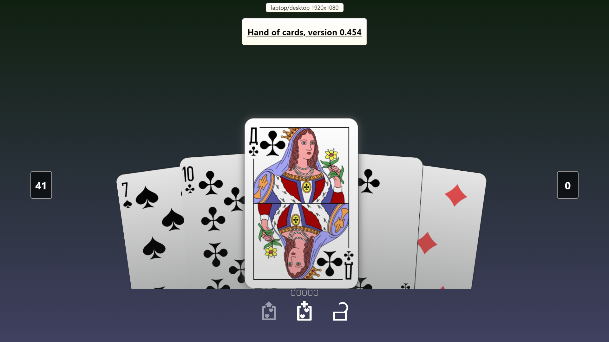

# hand-of-cards (v0.453)
This is React front-end carousel imitating holding and browsing through a hand of cards. To start the app, run a webserver in the directory containing the index.html file. Latest demo can be found on the [github pages](https://pointlesspun.github.io/hand-of-cards/).

For bugs and outstanding features see ['status'](#Status) below.

<center>
    
</center>

## Controls:
* On a laptop/desktop: 
    * Use _left_ / _right_ arrows to select the next / previous card. _Up_ and _down_ to put a card in a 'selected' state.
    * Press the _Delete_ key to remove the selected cards.
    * Hit _Enter_ to replace the deleted cards with new random cards.
    * Refresh the page to get a new set of random cards.
    * Press _Space_ to play the current selected cards (and remove them afterwards)

* On a device with a touch display:
    * Swipe left/right to select the next / previous card. Tap to toggle a card in a 'selected' state.
    * Refresh the page to get a new set of random cards.
    * Swipe up to select the current card
    * Swipe up again on an already selected card to play all the selected cards.

## Configurable Attributes
In the top level element one can currently set the following attributes:

* "maxCards", maxium number of cards in the hand and initial set of cards
* "maxSelectedCards", maximum number of cards which can be selected. After that the user cannot select any more cards
* "initialCardCount" how many cards does the player start with 
* "isLocked", if set to true, the cards will not scroll but stay in place.
* "maxCardsReachedPolicy" can have two values "blocked" and "cycle-oldest". When _blocked_ is applied, the user cannot select more than 'maxSelectedCards' and will get a warning when selecting more. When _cycle-oldest_ is applied the first selected card will be deselected and the current focused card will be selected when the 'maxSelectedCards' is reached.
* "foldCardsPolicy" can have two values "after-animation" or "immediateley". When _after-animation_ is selected the remaining cards in the hand will be folded after the play card animation is complete, when _immediately_ is selected the remaining cards in the hand will be folded as soon as the play animation begin.

Example:
```html
        <div
            id="card-container"
            class="app-container"
            initialCardCount="5"
            maxCards="7"
            maxSelectedCards="3"
            isLocked="false"
            maxCardsReachedPolicy="cycle-oldest"
            foldCardsPolicy="after-animation"
        ></div>
```

## 'Design'

The design (such as it is) of the element consists of the following implementing a MVP with MVVM elements (sort of, I guess):

* App (app.js): entry point and configuration of the application.
  * ToastComponent (/framework/toast-component.js) for all the toasts - independent from all the other components, communicates via a message bus.
  * CardGameModel (/model/card-game-model.js) contains the Model of the application
  * CardGameComponent (/card-game/card-game-component.js) is the Presenter, taking data from the model and events from the view / viewmodel.
  * CardCarouselComponent, ButtonPanelComponent, IndicatorComponent contain their own VewModels and implement the other View-parts.

## Status

This project was created while learning React and is currently very much under development. Clean-up and refactoring are very much in order. Outstanding features (in no particular order):

* [bug] resize is not always captured on mobile it seems
* Deal truly random cards or one from a deck of 52 cards.
* Dynamic spacing and rotation as the number of cards increase (see hearthstone)
* Adjust animations on mobile device
* fix wobble in the animation when browsing and selecting at the same time
* Overview at the start of application including which platforms are supported
* Indicate if platforms are supported or not
* Add (example) rule to card allowing cards to be played (or not)
* Try some optimization(s) for less powerful devices (aka phones).
* Test custom card layout other than a sprite atlas.
* Add 3d & cardbacks
* Test multiple players
* Create class for config.values.
* Refactor & add documentation.
* Add jsx (or htm) variation.


## Credits

Carousel Demonstration based on [this example](https://medium.com/tinyso/how-to-create-the-responsive-and-swipeable-carousel-slider-component-in-react-99f433364aa0")  by Thin Tran.
    
Swiping provided by [john-doherty/swiped-events](https://github.com/john-doherty/swiped-events).

Deck of cards [by Дмитрий Фомин (Dmitry Fomin) on Wiki](https://en.wikipedia.org/wiki/File:Atlasnye_playing_cards_deck.svg.) 

Keycode constants [Kabir Baidhya, Saugat Acharya](https://github.com/kabirbaidhya/keycode-js#usage)

Message bus [Gaurav Singhal](https://www.pluralsight.com/guides/how-to-communicate-between-independent-components-in-reactjs)


## Testing

Testing is implemented via [Jest](https://jestjs.io/) currently limited to a few support functions and the model. To test the model run "npm run test".